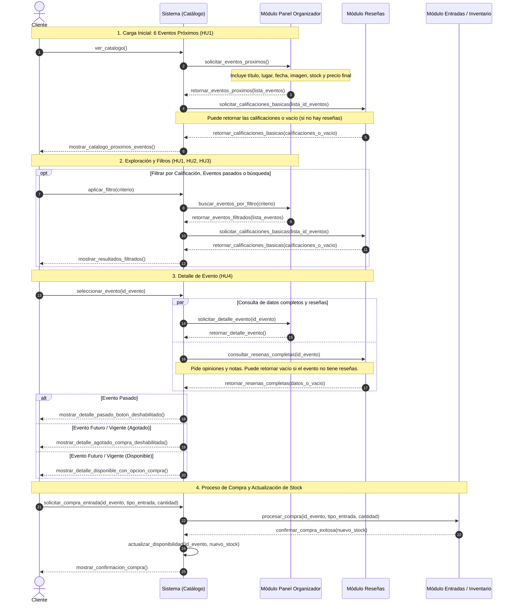

# Sistema de Catálogo y Gestión de Eventos

## Información del Equipo

* **Grupo 7:** Catálogo de Eventos
* **Integrantes:**
  * **Nombre:** Amalia Toledo — **Correo:** `amalia.toledo@estudiantes.uv.cl`
  * **Nombre:** Maximiliano Rozas — **Correo:** `maximiliano.rozas@estudiantes.uv.cl`
  * **Nombre:** Anaís Muñoz — **Correo:** `anais.munozm@estudiantes.uv.cl`
  * **Nombre:** Diego Valenzuela — **Correo:** `diego.valenzuelap@estudiantes.uv.cl`
  * **Nombre:** Gladys Carvacho — **Correo:** `gladys.carvacho@estudiantes.uv.cl`

---

## Diagrama de Secuencia



---

## Contratos de Interfaz

Los acuerdos de integración y especificaciones de endpoints pactados con los otros microservicios del ecosistema TicketU se encuentran documentados en la carpeta [`docs/`](docs/):

| Contrato | Consumidor | Proveedor | Descripción |
| :--- | :--- | :--- | :--- |
| [**CONTRATO_CATALOGO_PANEL.md**](docs/CONTRATO_CATALOGO_PANEL.md) | Catálogo de Eventos | Panel Organizador | Consulta de eventos próximos, filtros y ficha de detalle. |
| [**CONTRATO_CATALOGO_RESENAS.md**](docs/CONTRATO_CATALOGO_RESENAS.md) | Catálogo de Eventos | Reseñas | Calificaciones básicas (estrellas) y comentarios completos. |
| [**CONTRATO_CATALOGO_ENTRADAS.md**](docs/CONTRATO_CATALOGO_ENTRADAS.md) | Catálogo de Eventos | Entradas / Inventario | Solicitud de procesamiento de compra de entradas. |
| [**CONTRATO_ENTRADAS_CATALOGO.md**](docs/CONTRATO_ENTRADAS_CATALOGO.md) | Entradas / Inventario | Catálogo de Eventos | Actualización de stock en el catálogo tras compra exitosa. |

---

## Estructura del Proyecto

```text
Catalogo_de_eventos/
├── docs/
│   ├── diagrams/
│   │   └── README.md                       # Diagrama de secuencia y arquitectura
│   ├── CONTRATO_CATALOGO_PANEL.md          # Contrato con Panel Organizador
│   ├── CONTRATO_CATALOGO_RESENAS.md        # Contrato con Módulo Reseñas
│   ├── CONTRATO_CATALOGO_ENTRADAS.md       # Contrato de solicitud de compra con Entradas
│   └── CONTRATO_ENTRADAS_CATALOGO.md       # Contrato de actualización de stock desde Entradas
├── src/
│   ├── config/
│   │   └── supabase.js                     # Conexión al cliente de Supabase
│   ├── controllers/
│   │   └── eventController.js              # Lógica de negocio y consultas de eventos
│   ├── routes/
│   │   └── eventRoutes.js                  # Definición de rutas REST
│   └── index.js                            # Punto de entrada Express y Swagger
├── schema_db.sql                           # Esquema DDL e inserción de datos de prueba en PostgreSQL/Supabase
├── .env.example                            # Plantilla de variables de entorno
├── .gitignore                              # Archivos ignorados por Git
├── package.json
└── README.md
```

---

## Base de Datos

El diseño del modelo relacional se encuentra en [`schema_db.sql`](schema_db.sql). Utiliza PostgreSQL alojado en Supabase, incluyendo índices optimizados para:
* Búsqueda por texto rápido (`GIN` con `to_tsvector` en español).
* Filtrado acelerado por estado y categoría (`idx_eventos_estado_categoria`).
* Ordenamiento cronológico de eventos (`idx_eventos_fecha`).

---

## Puesta en Marcha del Backend

### 1. Requisitos
* [Node.js](https://nodejs.org/) (versión 18 o superior)
* Proyecto configurado en [Supabase](https://supabase.com/)

### 2. Instalación de dependencias
```bash
npm install
```

### 3. Configuración de variables de entorno
Copia el archivo `.env.example` como `.env` y completa tus credenciales:
```bash
cp .env.example .env
```
Configura los valores correspondientes:
```env
PORT=3000
SUPABASE_URL=https://tu-proyecto.supabase.co
SUPABASE_KEY=tu-clave-anonima-o-service-role
```

### 4. Ejecución en desarrollo
```bash
npm run dev
```

### 5. Documentación Interactiva y Health Check
Una vez iniciado el servidor:
* **API Documentation (Swagger UI):** `http://localhost:3000/api-docs`
* **Health Check:** `http://localhost:3000/health`
* **Listado de Eventos:** `GET http://localhost:3000/api/v1/events`
