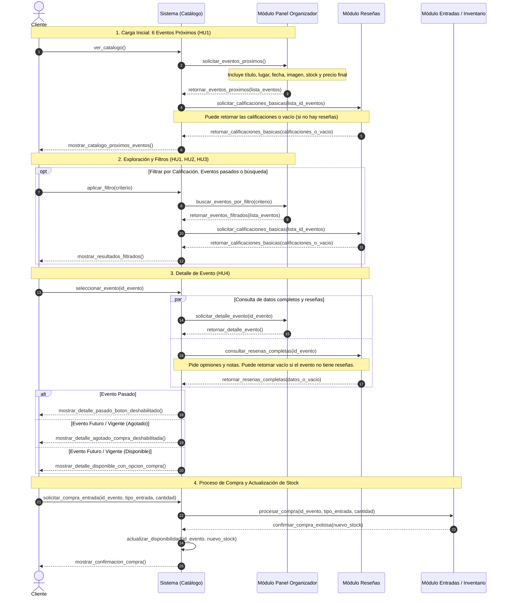

# Diagramas del Microservicio de Catálogo de Eventos

Esta carpeta contiene los diagramas arquitectónicos y de secuencia del microservicio **Catálogo de Eventos** (Equipo 7).

## Diagrama de Secuencia General

El diagrama de secuencia describe los 4 flujos principales de integración con los otros equipos del sistema TicketU:
1. **Carga Inicial de Catálogo:** Consulta de eventos próximos a Panel Organizador y notas básicas a Reseñas.
2. **Exploración y Filtros:** Búsqueda avanzada y filtros de eventos combinados con calificaciones.
3. **Detalle del Evento:** Consulta concurrente de ficha técnica a Panel Organizador y opiniones completas a Reseñas.
4. **Proceso de Compra y Actualización de Stock:** Orquestación con Entradas / Inventario y sincronización eventual de stock.

